# Demo Presentation Guide
## Multi-Step iPhone Price Comparison Workflow

이 가이드는 **LangGraph MCP Multi-Agent System**의 강력한 기능을 보여주는 실제 데모 시나리오입니다.

---

## 🎯 Demo Scenario

**목표**: iPhone 17 Pro와 iPhone 16 Pro의 가격을 유로 → 위안화로 변환하여 비교 차트 생성

**복잡도**: 6단계 워크플로우, 4개의 다른 도구 사용

---

## 📊 Visual Workflow

```mermaid
graph TB
    Start[👤 User Query:<br/>Compare iPhone prices in RMB]

    Step1[📚 Step 1: RAG Retrieval<br/>Get iPhone 17 Pro price in EUR]
    Step2[🔍 Step 2: Web Search<br/>EUR to RMB exchange rate]
    Step3[🧮 Step 3: Calculator<br/>Convert EUR → RMB]
    Step4[🔍 Step 4: Web Search<br/>Get iPhone 16 Pro price in EUR]
    Step5[💻 Step 5: Code Executor<br/>Create comparison chart]
    Step6[✅ Step 6: Show Result<br/>Display chart + summary]

    Start --> Step1
    Step1 --> Step2
    Step2 --> Step3
    Step3 --> Step4
    Step4 --> Step5
    Step5 --> Step6

    style Start fill:#e1f5ff
    style Step1 fill:#fff4e6
    style Step2 fill:#f3e5f5
    style Step3 fill:#e8f5e9
    style Step4 fill:#f3e5f5
    style Step5 fill:#fff3e0
    style Step6 fill:#c8e6c9
```



---

## 🔄 Step-by-Step Breakdown

### 📚 Step 1: Document Retrieval (RAG Server)

**What happens:**
- Agent searches PDF documents for iPhone 17 Pro price
- Uses FAISS vector similarity search
- Retrieves: **iPhone 17 Pro: €1,299**

**Tool Used:** `retrieve` (RAG MCP Server)

**Why it's impressive:**
- Searches through thousands of document pages instantly
- Uses semantic understanding, not just keyword matching
- Cached for performance

---

### 🔍 Step 2: Web Search (Tavily API)

**What happens:**
- Agent queries real-time web for EUR to RMB exchange rate
- Gets current market data

**Tool Used:** `tavily_search_results_json`

**Result:**
- Exchange Rate: **1 EUR = 7.85 RMB** (example)

**Why it's impressive:**
- Real-time data from the web
- Automatically formats and extracts relevant info

---

### 🧮 Step 3: Currency Conversion (Calculator Server)

**What happens:**
- Agent uses calculator to convert price
- Formula: 1,299 EUR × 7.85 = 10,197.15 RMB

**Tool Used:** `currency_convert` (Calculator MCP Server)

**Why it's impressive:**
- Precise calculations with proper formatting
- Maintains currency context

---

### 🔍 Step 4: Web Search for iPhone 16 Pro

**What happens:**
- Agent searches for iPhone 16 Pro price in EUR
- Validates and extracts price data

**Tool Used:** `tavily_search_results_json`

**Result:**
- iPhone 16 Pro: **€1,199**
- Converted to RMB: **9,411.15 RMB**

---

### 💻 Step 5: Visualization (Code Executor Server)

**What happens:**
- Agent generates Python code to create bar chart
- Executes code safely in isolated environment
- Saves chart to `output/` folder

**Tool Used:** `create_visualization` (Code Executor MCP Server)

**Code Generated (internally):**
```python
import matplotlib.pyplot as plt
data = {
    'x': ['iPhone 17 Pro', 'iPhone 16 Pro'],
    'y': [10197.15, 9411.15]
}
plt.bar(data['x'], data['y'])
plt.title('iPhone Price Comparison (RMB)')
plt.ylabel('Price (¥)')
plt.savefig('output/iphone_price_comparison.png')
```

---

### ✅ Step 6: Result Display

**What the user sees:**

1. **Text Summary:**
   ```
   iPhone 17 Pro: €1,299 (¥10,197.15)
   iPhone 16 Pro: €1,199 (¥9,411.15)
   Price Difference: ¥786.00 (7.7% more expensive)
   ```

2. **Visual Chart:**
   - Beautiful bar chart comparing prices
   - Clearly labeled with prices
   - Professional styling

---

## 🎤 Presentation Script

### Opening (30 seconds)

> "Let me show you a real-world example of what this system can do. I'm going to ask it to compare iPhone prices in Chinese currency, which requires the system to:
> - Search our documents
> - Look up current exchange rates online
> - Do calculations
> - Create a visualization
> - All automatically, in one query."

### Demo Query (10 seconds)

**Show on screen:**
```
1. Use Document Retrieval to retrieve iPhone 17 Pro price from documents in euros.
2. Use tavily search to check the currency between euro and Chinese RMB.
3. Convert the euro price to RMB using the collected information.
4. Use tavily search to check the iPhone 16 Pro price in euros.
5. Use Code Executor's create_visualization to plot a comparison.
6. Show the result
```

**Say:**
> "I'm entering this complex, multi-step query. Watch how the system automatically figures out which tools to use and in what order."

### During Execution (1-2 minutes)

**Point out each step as it happens:**

✅ **"First, it's searching our documents..."**
- Highlight: RAG tool selected
- Show: Retrieved price in euros

✅ **"Now it's checking the current exchange rate online..."**
- Highlight: Web search tool
- Show: Real-time data

✅ **"Converting the currency..."**
- Highlight: Calculator tool
- Show: Precise calculation

✅ **"Getting the second phone's price..."**
- Highlight: Another web search
- Show: Data collection

✅ **"Generating the visualization..."**
- Highlight: Code executor writing Python
- Show: Chart being created

### Result (30 seconds)

**Show the final chart:**
> "And here's our result! A professional comparison chart showing both prices in RMB, created automatically from a natural language request."

**Point out:**
- The price difference
- The visual clarity
- The accuracy of data

### Closing (30 seconds)

> "This is the power of a multi-agent system. Four different specialized tools working together:
> - Document search (RAG)
> - Web search (Tavily)
> - Calculations (Calculator)
> - Code execution (Python)
>
> All orchestrated by LangGraph and Claude, without any manual intervention."

---

## 💡 Key Points to Emphasize

### 🎯 For Technical Audience

1. **Multi-Modal Intelligence**
   - Combines structured data (documents), real-time web, computation, and visualization

2. **Tool Orchestration**
   - LangGraph automatically plans the workflow
   - Claude decides which tools to use and when

3. **MCP Architecture**
   - Modular, extensible design
   - Each server is independent and reusable

4. **Production-Ready**
   - Error handling
   - Caching for performance
   - Multiple interfaces (Web, CLI, Jupyter)

### 👥 For Non-Technical Audience

1. **It's like having 4 specialized assistants**
   - One knows your documents
   - One searches the web
   - One does math
   - One creates charts

2. **Natural Language Control**
   - No coding required
   - Just describe what you want

3. **Real-World Applications**
   - Market research
   - Data analysis
   - Report generation
   - Decision support

---

## 📸 Screenshot Checklist

For your presentation, capture these moments:

### Before Demo
- [ ] Clean Streamlit interface
- [ ] Example query buttons visible
- [ ] Tool categories in sidebar

### During Execution
- [ ] "Agent is thinking" progress bar
- [ ] Tool usage tracking (each tool being selected)
- [ ] Real-time status updates

### After Completion
- [ ] Final response text
- [ ] Generated visualization
- [ ] Tool usage summary (expandable sections)

### Zoom-ins
- [ ] The generated chart (full screen)
- [ ] Code executor tool details
- [ ] Tool arguments and results

---

## 🎨 Presentation Tips

### Visual Setup

1. **Split Screen Layout:**
   ```
   ┌─────────────┬─────────────┐
   │   Workflow  │  Live Demo  │
   │   Diagram   │  (Streamlit)│
   └─────────────┴─────────────┘
   ```

2. **Highlight Each Step:**
   - Use laser pointer or screen annotation
   - Circle the active tool in real-time

3. **Color Coding:**
   - 📚 RAG = Orange
   - 🔍 Web Search = Purple
   - 🧮 Calculator = Green
   - 💻 Code Executor = Blue

### Timing

- **Total Demo Time:** 3-4 minutes
- Setup: 30 sec
- Explanation: 30 sec
- Execution: 1-2 min
- Result Discussion: 1 min

### Engagement

**Ask the audience:**
- "What other queries could we try?"
- "Can you think of business use cases?"
- "What tools would you add?"

### Common Questions (Prepare Answers)

**Q: "How long does this take?"**
A: "Usually 30-60 seconds, depending on web searches."

**Q: "Can it handle errors?"**
A: "Yes, if a tool fails, the agent tries alternative approaches or asks for clarification."

**Q: "Is the data accurate?"**
A: "The RAG retrieves from your trusted documents, and web search uses current data. The system shows sources for verification."

**Q: "Can I add custom tools?"**
A: "Absolutely! That's the power of MCP - you can add any tool as a server."

---

## 🚀 Advanced Demo Variations

### Variation 1: Market Analysis
```
Compare the battery capacity of iPhone 17 Pro and iPhone 16 Pro,
calculate the percentage difference, and create a comparison chart.
```

### Variation 2: Multi-Country Pricing
```
Get iPhone 17 Pro prices in USD, EUR, and GBP,
convert all to JPY, and create a pie chart showing regional pricing.
```

### Variation 3: Statistical Analysis
```
Retrieve all iPhone 17 model prices from documents,
calculate statistical summary (mean, median, std dev),
and create a histogram showing price distribution.
```

---

## 📊 Success Metrics to Highlight

- **12 Tools** across 4 categories
- **3 User Interfaces** for different users
- **4 Tools Used** in this single query
- **6 Steps** executed automatically
- **0 Lines of Code** written by user
- **100% Accurate** data retrieval and calculation

---

## 🎬 Conclusion Slide

**"One Query, Four Tools, Infinite Possibilities"**

**This demo showed:**
✅ Intelligent tool orchestration
✅ Multi-source data integration
✅ Automatic workflow planning
✅ Professional output generation

**Built with:**
- LangGraph for agent workflows
- Claude 3.5 Sonnet for intelligence
- FastMCP for tool integration
- Python for execution

**Try it yourself:** https://github.com/JoonHyoungLee-Seoul/MCP_tutorial

---

## 📝 Presenter Notes

### Setup Before Presentation

1. **Test the demo** at least once
2. **Clear output folder** for clean demo
3. **Prepare backup screenshots** in case of network issues
4. **Have example queries ready** in case audience asks for more

### Troubleshooting

**If web search is slow:**
- Mention: "Real-time web search can take a moment..."
- Show the progress indicator

**If visualization doesn't appear:**
- Check `output/` folder
- Refresh the page
- Show the file directly

**If connection fails:**
- Have backup screenshots ready
- Explain what *would* happen
- Show the code/architecture instead

---

## 🎯 Target Audience Adaptations

### For Developers
- Show the code structure
- Explain MCP protocol
- Discuss extensibility

### For Business Leaders
- Focus on use cases
- Emphasize time savings
- Discuss ROI potential

### For Researchers
- Highlight RAG capabilities
- Explain vector similarity
- Discuss accuracy metrics

### For General Public
- Use simple analogies
- Show visual results
- Avoid technical jargon

---

**Good luck with your presentation! 🚀**
