# LangGraph MCP RAG Agent Tutorial

A comprehensive tutorial for building RAG (Retrieval-Augmented Generation) agents using LangGraph and MCP (Model Context Protocol).

## Project Overview

This project demonstrates how to build a powerful AI agent by integrating:
- **LangGraph**: Building complex agent workflows
- **MCP (Model Context Protocol)**: Tool and external system integration
- **RAG (Retrieval-Augmented Generation)**: Document-based information retrieval
- **TavilySearch**: Real-time web search
- **Claude 3.5 Sonnet**: Anthropic's latest LLM model

## Architecture Overview

### System Architecture

```mermaid
graph TB
    subgraph "User Interfaces"
        A1[🌐 Streamlit Web UI<br/>web_demo.py]
        A2[💻 Python CLI<br/>agent.py]
        A3[📓 Jupyter Notebook<br/>examples/MCP.ipynb]
    end

    subgraph "Agent Core"
        B[🤖 LangGraph ReAct Agent<br/>Reasoning + Acting Loop]
    end

    subgraph "MCP Servers"
        C1[📚 RAG Server<br/>mcp_server_rag.py<br/>1 tool]
        C2[🧮 Calculator Server<br/>mcp_server_calculator.py<br/>5 tools]
        C3[💻 Code Executor Server<br/>mcp_server_code_executor.py<br/>5 tools]
    end

    subgraph "External Services"
        D1[🔍 Tavily Search<br/>Web Search API<br/>1 tool]
        D2[🧠 Claude 3.5 Sonnet<br/>Anthropic API]
    end

    subgraph "Data Sources"
        E1[(📄 PDF Documents<br/>data/)]
        E2[(🗂️ FAISS Index<br/>Vector Store)]
    end

    subgraph "Outputs"
        F1[📊 Visualizations<br/>output/*.png]
        F2[📋 Data Files<br/>output/*.csv]
        F3[💬 Chat Responses]
    end

    A1 --> B
    A2 --> B
    A3 --> B

    B --> C1
    B --> C2
    B --> C3
    B --> D1
    B --> D2

    C1 --> E1
    C1 --> E2
    E1 --> E2

    C2 --> F3
    C3 --> F1
    C3 --> F2
    C1 --> F3
    D1 --> F3

    style B fill:#e1f5ff
    style C1 fill:#fff4e6
    style C2 fill:#fff4e6
    style C3 fill:#fff4e6
    style D1 fill:#f3e5f5
    style D2 fill:#f3e5f5
```



### Data Flow

```mermaid
sequenceDiagram
    participant User
    participant Agent
    participant RAG as 📚 RAG Server
    participant Calc as 🧮 Calculator
    participant Code as 💻 Code Executor
    participant Web as 🔍 Web Search
    participant Claude as 🧠 Claude 3.5

    User->>Agent: Query: "Retrieve iPhone 17 price and create chart"
    Agent->>Claude: Analyze query + available tools
    Claude->>Agent: Plan: 1) RAG retrieve 2) Code visualize

    Agent->>RAG: retrieve("iPhone 17 price")
    RAG->>RAG: Search FAISS vector store
    RAG-->>Agent: "iPhone 17: $799"

    Agent->>Claude: Process retrieved data
    Claude->>Agent: Next: Create visualization

    Agent->>Code: create_visualization(data, type="bar")
    Code->>Code: Generate matplotlib chart
    Code-->>Agent: "Saved to output/chart.png"

    Agent->>User: ✅ Response + 📊 Chart
```



### Tool Distribution

```mermaid
pie title "12 Tools Across 4 Categories"
    "📚 RAG Retriever" : 1
    "🧮 Calculator" : 5
    "💻 Code Executor" : 5
    "🔍 Web Search" : 1
```



### Project Structure Map


## Key Features

### 1. Multi-Tool Integration (Total 12 Tools!)
- **RAG Retriever** (1 tool): Search information from PDF documents
- **Calculator** (5 tools): Math calculations, statistics, currency conversion, value comparison
- **Code Executor** (5 tools): Python code execution, data analysis, visualization
- **TavilySearch** (1 tool): Search latest news and web information
- **Automatic Tool Selection**: Agent automatically selects appropriate tools based on queries

### 2. MCP Server Implementation
#### 📚 RAG Retriever MCP (`mcp_server_rag.py`)
- FAISS vector store-based document retrieval
- Text embedding via OpenAI Embeddings
- Performance optimization through global caching
- Batch PDF document loading

#### 🧮 Calculator MCP (`mcp_server_calculator.py`)
- Mathematical expression evaluation (trig functions, logarithms, square roots, etc.)
- Percentage change calculation
- Statistical summary (mean, median, standard deviation)
- Currency conversion
- Value comparison analysis

#### 💻 Code Executor MCP (`mcp_server_code_executor.py`)
- Safe Python code execution (pandas, numpy, matplotlib)
- Data visualization (5 chart types: line, bar, scatter, pie, hist)
- Data analysis (statistics, grouping, sorting, correlation)
- CSV file read/write

### 3. Real-time Streaming
- Real-time monitoring of agent execution
- Tool usage tracking (selection and execution)
- Color-coded output for better readability

## Installation

### 1. Prerequisites
- Python 3.12+
- Virtual Environment (venv)
- Jupyter Notebook (optional, for interactive development)

### 2. Clone Repository

```bash
git clone <your-repo-url>
cd lee_mcp_tutorial
```

### 3. Create Virtual Environment

```bash
python3 -m venv venv
source venv/bin/activate  # On Windows: venv\Scripts\activate
```

### 4. Install Dependencies

```bash
pip install -r requirements.txt
```

### 5. Register Jupyter Kernel (Optional)

If you want to use the Jupyter Notebook interface:

```bash
python -m ipykernel install --user --name=langgraph-mcp --display-name="Python (langgraph-mcp)"
```

### 6. Environment Setup

Create a `.env` file with the following content:

```bash
ANTHROPIC_API_KEY=your_anthropic_api_key_here
OPENAI_API_KEY=your_openai_api_key_here
LANGSMITH_API_KEY=your_langsmith_api_key_here
LANGSMITH_TRACING=true
LANGSMITH_ENDPOINT=https://api.smith.langchain.com
LANGSMITH_PROJECT=LangGraph-MCP-Agents
TAVILY_API_KEY=your_tavily_api_key_here
```

**Important**: Remove `OPENAI_BASE_URL` from system environment variables if set. This project uses OpenAI API directly.

## Usage

### Quick Start

This project provides **3 different interfaces** to interact with the agent:

#### 1️⃣ Jupyter Notebook (Interactive Development)

```bash
jupyter notebook examples/MCP.ipynb
```

**Best for**: Step-by-step exploration, learning, and seeing immediate results

#### 2️⃣ Python CLI (Command Line)

```bash
python agent.py
```

**Best for**: Quick testing, automation, script integration

Example:
```
👤 You: Create a bar chart showing iPhone sales
🤖 Agent: [Response with chart generation]
👤 You: quit
```

#### 3️⃣ Streamlit Web Demo (Web Interface)

```bash
streamlit run web_demo.py
```

**Best for**: Presentations, demos, non-technical users

Features:
- 📌 Example query buttons
- 🖼️ Auto-display generated images
- 📊 Real-time statistics
- 🎨 Beautiful GUI

See [QUICK_START.md](./docs/QUICK_START.md) for detailed instructions.

### Prepare PDF Documents

Place PDF documents in the `data/` directory:

```bash
data/
├── document1.pdf
├── document2.pdf
└── ...
```

### 3. Cell Execution Order

#### Cell 0: Environment Setup
```python
# Set working directory and load environment variables
```

#### Cell 3: Tool Initialization
```python
# Configure MCP client and TavilySearch
# Use MultiServerMCPClient for automatic session management
```

#### Cell 5: Agent Creation
```python
# Create and configure ReAct agent
```

#### Cell 7: TavilySearch Test
```python
# Example: Latest news search
await astream_graph(
    agent,
    {"messages": "Tell me about iPhone 17 sales..."},
    config=config
)
```

#### Cell 9: RAG Retriever Test
```python
# Example: Search information from documents
await astream_graph(
    agent,
    {"messages": "What are the specifications of iPhone 17 Pro Camera?"},
    config=config
)
```

#### Cell 11: Combined Usage
```python
# Example: Using both tools
await astream_graph(
    agent,
    {"messages": "First retrieve color options, then search for news..."},
    config=config
)
```

## Project Structure

```
lee_mcp_tutorial/
├── 📓 User Interfaces
│   ├── agent.py                   # Python CLI (command line)
│   ├── web_demo.py                # Streamlit Web Demo (web UI)
│   └── utils_streamlit.py         # Streamlit utilities
│
├── 🤖 MCP Servers
│   ├── mcp_server_rag.py          # 📚 RAG Retriever (document search)
│   ├── mcp_server_calculator.py   # 🧮 Calculator (math & stats)
│   └── mcp_server_code_executor.py# 💻 Code Executor (Python & viz)
│
├── 🔧 Utilities
│   ├── utils.py                   # Streaming & tool tracking
│   └── .env                       # Environment variables (create this)
│
├── 📁 Data & Output
│   ├── data/                      # PDF documents
│   │   ├── *.pdf                  # Place your PDF files here
│   │   └── ...
│   └── output/                    # Generated files (auto-created)
│       ├── *.png                  # Charts & visualizations
│       └── *.csv                  # Data files
│
├── 📚 Examples
│   └── MCP.ipynb                  # Jupyter Notebook tutorial
│
├── 🧪 Tests
│   ├── test_agent_init.py         # Agent initialization test
│   ├── test_calculator.py         # Calculator tools test
│   └── test_visualization.py      # Visualization test
│
├── 📖 Documentation
│   ├── QUICK_START.md             # Quick start guide
│   ├── USAGE_GUIDE.md             # Detailed usage
│   ├── CALCULATOR_USAGE.md        # Calculator tool guide
│   ├── CODE_EXECUTOR_USAGE.md     # Code executor guide
│   ├── NOTEBOOK_EXAMPLES.md       # Example collection
│   ├── FIX_NOTES.md               # Troubleshooting fixes
│   ├── VISUALIZATION_FIX.md       # Visualization fixes
│   ├── WEB_DEMO_IMPROVEMENTS.md   # Web demo features
│   ├── EMPTY_CHART_FIX.md         # Chart debugging guide
│   └── STREAMLIT_UI_PREVIEW.md    # UI preview
│
├── 📋 Configuration
│   ├── requirements.txt           # Python dependencies
│   ├── .gitignore                 # Git ignore rules
│   ├── README.md                  # English README (this file)
│   ├── README_KOR.md              # Korean README
│   └── RUN_WEB_DEMO.sh            # Web demo launcher script
│
└── 🗑️ Ignored Files (see .gitignore)
    ├── __pycache__/               # Python cache
    ├── .DS_Store                  # macOS metadata
    ├── .env                       # API keys (DO NOT COMMIT)
    └── output/*.png               # Generated images
```

### File Descriptions

#### User Interfaces

##### `agent.py` ⭐NEW
Standalone Python CLI for the MCP multi-agent system:
- Can be run independently without Jupyter
- Command-line interface for quick testing
- Provides `create_mcp_agent()` function for programmatic use
- Interactive loop with quit/exit commands

Usage:
```bash
python agent.py
```

Or import in your own code:
```python
from agent import create_mcp_agent, chat_with_agent
agent, config, tools = create_mcp_agent()
```

##### `web_demo.py` ⭐NEW
Streamlit-based web interface:
- Beautiful GUI with example query buttons
- Real-time tool usage tracking
- Auto-display of generated charts and images
- Sidebar with tool categories and stats
- File browser for generated outputs

Launch:
```bash
streamlit run web_demo.py
```

##### `MCP.ipynb` (in examples/)
Original Jupyter Notebook interface for interactive development and learning.

##### `utils_streamlit.py`
Streamlit-specific utility functions:
- `display_agent_response_streamlit()`: Beautiful UI rendering for agent responses
- `astream_graph_streamlit()`: Streamlit-compatible graph streaming
- `get_tool_icon()`: Tool emoji mapping
- `format_tool_result()`: Result formatting for display

#### MCP Servers

#### `mcp_server_rag.py`
- FastMCP-based MCP server
- PDF document loading (DirectoryLoader)
- FAISS vector store creation
- OpenAI Embeddings usage
- Global caching for retriever reuse
- Provides `retrieve(query: str)` tool

**Core Function**:
```python
@mcp.tool()
async def retrieve(query: str) -> str:
    """Retrieve information from document database"""
    global _retriever
    if _retriever is None:
        _retriever = create_retriever()
    retrieved_docs = _retriever.invoke(query)
    return "\n".join([doc.page_content for doc in retrieved_docs])
```

#### `utils.py`
Core utility functions:
- `astream_graph()`: LangGraph execution streaming function
- `print_tool_info()`: Tool usage tracking and output
- Color-coded output (🔧 Tool Selected, ✅ Tool Executed)

#### Documentation Files (in docs/)

See the `docs/` folder for detailed guides:
- **QUICK_START.md**: Fast setup and usage guide
- **USAGE_GUIDE.md**: Comprehensive usage instructions
- **CALCULATOR_USAGE.md**: Calculator MCP server documentation
- **CODE_EXECUTOR_USAGE.md**: Code executor MCP server documentation
- **NOTEBOOK_EXAMPLES.md**: Jupyter notebook example queries
- **FIX_NOTES.md**, **VISUALIZATION_FIX.md**: Troubleshooting guides

## Technology Stack

### LLM & AI Framework
- **Claude 3.5 Sonnet** (`claude-3-7-sonnet-latest`): Anthropic's latest large language model
- **LangChain**: LLM application framework
- **LangGraph**: Complex agent workflow construction

### MCP (Model Context Protocol)
- **FastMCP**: Fast MCP server building framework
- **langchain-mcp-adapters**: LangChain and MCP integration
- **MultiServerMCPClient**: Multiple MCP server management

### Document Processing & Search
- **PyMuPDFLoader**: PDF file loading
- **DirectoryLoader**: Directory-based bulk document loading
- **RecursiveCharacterTextSplitter**: Text chunking
- **FAISS**: High-speed vector similarity search
- **OpenAI Embeddings**: Text embedding (`text-embedding-3-small`)

### Web Search
- **TavilySearch**: Real-time news and web search

### Development Tools
- **Jupyter Notebook**: Interactive development environment
- **python-dotenv**: Environment variable management
- **LangSmith**: LLM application monitoring and debugging

## Troubleshooting

### 1. `ClosedResourceError` Occurring

**Symptom**: `Error: ClosedResourceError()` when executing `retrieve` tool

**Cause**: When using `stdio_client` + `ClientSession`, session automatically closes when `async with` block ends

**Solution**: Use `MultiServerMCPClient`
```python
# ❌ Incorrect approach
async with stdio_client(server_params) as (read, write):
    async with ClientSession(read, write) as session:
        tools = await load_mcp_tools(session)
# Session closes when block ends

# ✅ Correct approach
client = MultiServerMCPClient({
    "document-retriever": {
        "command": "../.venv/bin/python",
        "args": ["./mcp_server_rag.py"],
        "transport": "stdio",
    }
})
tools = await client.get_tools()  # Session remains active
```

### 2. `OPENAI_BASE_URL` Related 403 Error

**Symptom**: `PermissionDeniedError: 403 unauthorized` when using OpenAI Embeddings

**Cause**: System environment variable has `OPENAI_BASE_URL=https://api.fireworks.ai/...`

**Solution**:
```python
# Already applied in mcp_server_rag.py
if 'OPENAI_BASE_URL' in os.environ:
    del os.environ['OPENAI_BASE_URL']
```

### 3. `load_dotenv()` Failure

**Symptom**: `.env` file loading fails

**Cause**: Working directory differs from `.env` file location

**Solution**:
```python
import os
os.chdir('/Users/ijunhyeong/Desktop/mcp/langgraph-mcp-agents/lee_mcp_tutorial')
load_dotenv(override=True)
```

### 4. Jupyter Kernel Not Selectable

**Symptom**: "langgraph-mcp" kernel not in list

**Solution**:
```bash
source ../.venv/bin/activate
python -m ipykernel install --user --name=langgraph-mcp --display-name="Python (langgraph-mcp)"
```

### 5. Module Import Error

**Symptom**: `ModuleNotFoundError: No module named 'utils'`

**Cause**: Project directory not in Python path

**Solution**:
```python
import sys
sys.path.insert(0, '/Users/ijunhyeong/Desktop/mcp/langgraph-mcp-agents/lee_mcp_tutorial')
```

## Learning Points

### 1. MCP Session Management
- `stdio_client` + `ClientSession`: Valid only within block scope
- `MultiServerMCPClient`: Maintains session globally
- `MultiServerMCPClient` recommended for Jupyter Notebook

### 2. RAG Optimization
- Cache retriever in global variable
- Initialization only on first call
- Set `show_progress=False` in stdio mode

### 3. Agent Prompting
```python
prompt = (
    "You are a smart agent with multiple tools. "
    "Use `retrieve` tool to search information from iPhone documents. "
    "Use `tavily_search_results_json` tool to search recent news. "
    "Answer in English."
)
```
- Provide clear tool usage instructions
- Specify purpose of each tool explicitly

### 4. Streaming Output
- Real-time output with `astream_graph()` function
- Tool tracking with `print_tool_info()` function
- Enhanced readability with color coding

## References

- [LangGraph Documentation](https://langchain-ai.github.io/langgraph/)
- [Model Context Protocol (MCP)](https://modelcontextprotocol.io/)
- [FastMCP](https://github.com/jlowin/fastmcp)
- [Anthropic Claude](https://www.anthropic.com/claude)
- [LangChain](https://python.langchain.com/)
- [FAISS](https://github.com/facebookresearch/faiss)

## License

This project is free to use for learning and research purposes.

## Contributing

Bug reports, feature suggestions, and Pull Requests are always welcome!
